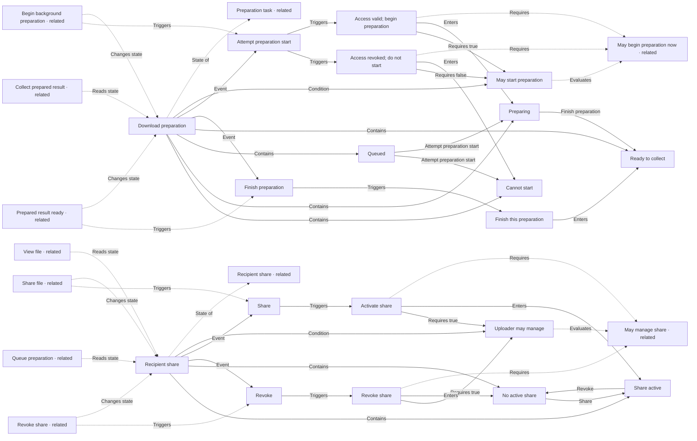

```mermaid
flowchart LR
  n0["Finish preparation"]
  n1["Attempt preparation start"]
  n2["Revoke"]
  n3["Share"]
  n4["May start preparation"]
  n5["Uploader may manage"]
  n6["Download preparation"]
  n7["Recipient share"]
  n8["Cannot start"]
  n9["Preparing"]
  n10["Queued"]
  n11["Ready to collect"]
  n12["Share active"]
  n13["No active share"]
  n14["Access revoked; do not start"]
  n15["Finish this preparation"]
  n16["Access valid; begin preparation"]
  n17["Revoke share"]
  n18["Activate share"]
  n1 -->|"Triggers"| n14
  n0 -->|"Triggers"| n15
  n1 -->|"Triggers"| n16
  n2 -->|"Triggers"| n17
  n3 -->|"Triggers"| n18
  n6 -->|"Contains"| n8
  n6 -->|"Contains"| n9
  n6 -->|"Contains"| n10
  n6 -->|"Contains"| n11
  n7 -->|"Contains"| n12
  n7 -->|"Contains"| n13
  n6 -->|"Event"| n0
  n6 -->|"Event"| n1
  n7 -->|"Event"| n2
  n7 -->|"Event"| n3
  n6 -->|"Condition"| n4
  n7 -->|"Condition"| n5
  n10 -->|"Attempt preparation start"| n8
  n9 -->|"Finish preparation"| n11
  n10 -->|"Attempt preparation start"| n9
  n12 -->|"Revoke"| n13
  n13 -->|"Share"| n12
  n14 -->|"Requires false"| n4
  n16 -->|"Requires true"| n4
  n17 -->|"Requires true"| n5
  n18 -->|"Requires true"| n5
  n14 -->|"Enters"| n8
  n15 -->|"Enters"| n11
  n16 -->|"Enters"| n9
  n17 -->|"Enters"| n13
  n18 -->|"Enters"| n12
  b0["May begin preparation now · related"]
  n4 -.->|"Evaluates"| b0
  b1["May manage share · related"]
  n5 -.->|"Evaluates"| b1
  b2["Prepared result ready · related"]
  b2 -.->|"Triggers"| n0
  n14 -.->|"Requires"| b0
  n16 -.->|"Requires"| b0
  b3["Revoke share · related"]
  b3 -.->|"Triggers"| n2
  n17 -.->|"Requires"| b1
  b4["Share file · related"]
  b4 -.->|"Triggers"| n3
  n18 -.->|"Requires"| b1
  b5["Begin background preparation · related"]
  b5 -.->|"Triggers"| n1
  b5 -.->|"Changes state"| n6
  b6["Collect prepared result · related"]
  b6 -.->|"Reads state"| n6
  b2 -.->|"Changes state"| n6
  b7["Queue preparation · related"]
  b7 -.->|"Reads state"| n7
  b3 -.->|"Changes state"| n7
  b4 -.->|"Changes state"| n7
  b8["View file · related"]
  b8 -.->|"Reads state"| n7
  b9["Preparation task · related"]
  n6 -.->|"State of"| b9
  b10["Recipient share · related"]
  n7 -.->|"State of"| b10
```
