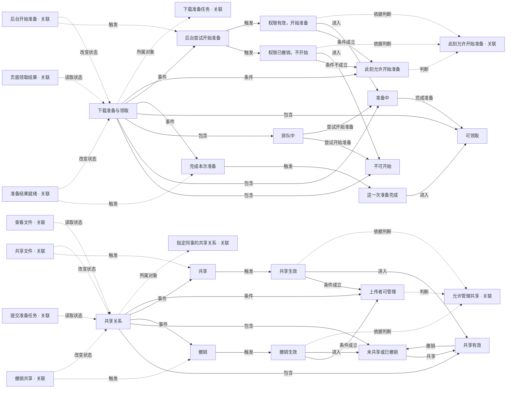

```mermaid
flowchart LR
  n0["完成本次准备"]
  n1["后台尝试开始准备"]
  n2["撤销"]
  n3["共享"]
  n4["此刻允许开始准备"]
  n5["上传者可管理"]
  n6["下载准备与领取"]
  n7["共享关系"]
  n8["不可开始"]
  n9["准备中"]
  n10["排队中"]
  n11["可领取"]
  n12["共享有效"]
  n13["未共享或已撤销"]
  n14["权限已撤销，不开始"]
  n15["这一次准备完成"]
  n16["权限有效，开始准备"]
  n17["撤销生效"]
  n18["共享生效"]
  n1 -->|"触发"| n14
  n0 -->|"触发"| n15
  n1 -->|"触发"| n16
  n2 -->|"触发"| n17
  n3 -->|"触发"| n18
  n6 -->|"包含"| n8
  n6 -->|"包含"| n9
  n6 -->|"包含"| n10
  n6 -->|"包含"| n11
  n7 -->|"包含"| n12
  n7 -->|"包含"| n13
  n6 -->|"事件"| n0
  n6 -->|"事件"| n1
  n7 -->|"事件"| n2
  n7 -->|"事件"| n3
  n6 -->|"条件"| n4
  n7 -->|"条件"| n5
  n10 -->|"尝试开始准备"| n8
  n9 -->|"完成准备"| n11
  n10 -->|"尝试开始准备"| n9
  n12 -->|"撤销"| n13
  n13 -->|"共享"| n12
  n14 -->|"条件不成立"| n4
  n16 -->|"条件成立"| n4
  n17 -->|"条件成立"| n5
  n18 -->|"条件成立"| n5
  n14 -->|"进入"| n8
  n15 -->|"进入"| n11
  n16 -->|"进入"| n9
  n17 -->|"进入"| n13
  n18 -->|"进入"| n12
  b0["此刻允许开始准备 · 关联"]
  n4 -.->|"判断"| b0
  b1["允许管理共享 · 关联"]
  n5 -.->|"判断"| b1
  b2["准备结果就绪 · 关联"]
  b2 -.->|"触发"| n0
  n14 -.->|"依据判断"| b0
  n16 -.->|"依据判断"| b0
  b3["撤销共享 · 关联"]
  b3 -.->|"触发"| n2
  n17 -.->|"依据判断"| b1
  b4["共享文件 · 关联"]
  b4 -.->|"触发"| n3
  n18 -.->|"依据判断"| b1
  b5["后台开始准备 · 关联"]
  b5 -.->|"触发"| n1
  b5 -.->|"改变状态"| n6
  b6["页面领取结果 · 关联"]
  b6 -.->|"读取状态"| n6
  b2 -.->|"改变状态"| n6
  b7["提交准备任务 · 关联"]
  b7 -.->|"读取状态"| n7
  b3 -.->|"改变状态"| n7
  b4 -.->|"改变状态"| n7
  b8["查看文件 · 关联"]
  b8 -.->|"读取状态"| n7
  b9["下载准备任务 · 关联"]
  n6 -.->|"所属对象"| b9
  b10["指定同事的共享关系 · 关联"]
  n7 -.->|"所属对象"| b10
```
