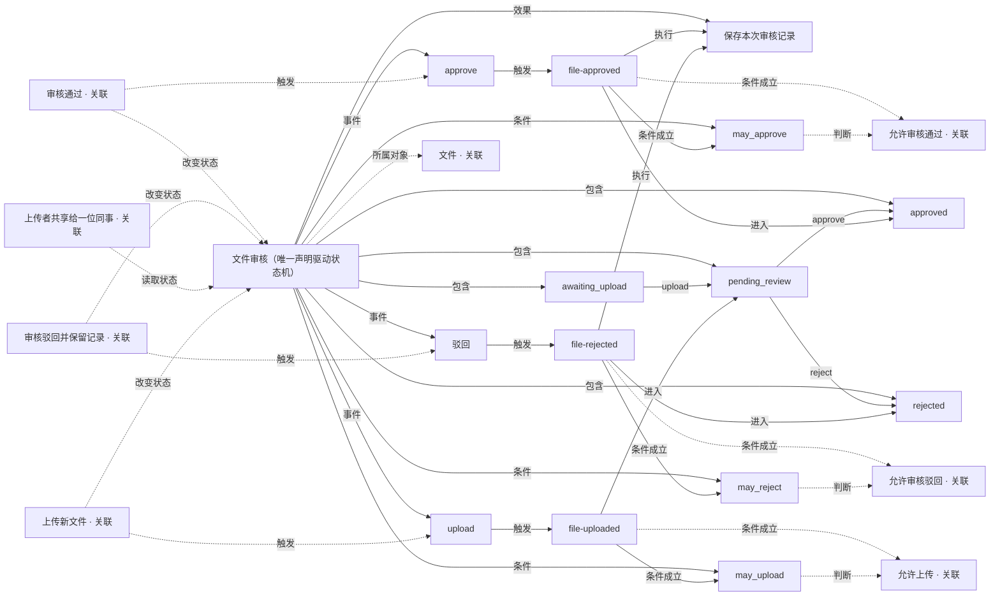

# 状态网

```mermaid
flowchart LR
  n0["保存本次审核记录"]
  n1["approve"]
  n2["驳回"]
  n3["upload"]
  n4["may_approve"]
  n5["may_reject"]
  n6["may_upload"]
  n7["文件审核（唯一声明驱动状态机）"]
  n8["approved"]
  n9["awaiting_upload"]
  n10["pending_review"]
  n11["rejected"]
  n12["file-approved"]
  n13["file-rejected"]
  n14["file-uploaded"]
  n1 -->|"触发"| n12
  n2 -->|"触发"| n13
  n3 -->|"触发"| n14
  n7 -->|"包含"| n8
  n7 -->|"包含"| n9
  n7 -->|"包含"| n10
  n7 -->|"包含"| n11
  n7 -->|"效果"| n0
  n7 -->|"事件"| n1
  n7 -->|"事件"| n2
  n7 -->|"事件"| n3
  n7 -->|"条件"| n4
  n7 -->|"条件"| n5
  n7 -->|"条件"| n6
  n10 -->|"approve"| n8
  n10 -->|"reject"| n11
  n9 -->|"upload"| n10
  n12 -->|"执行"| n0
  n13 -->|"执行"| n0
  n12 -->|"条件成立"| n4
  n13 -->|"条件成立"| n5
  n14 -->|"条件成立"| n6
  n12 -->|"进入"| n8
  n13 -->|"进入"| n11
  n14 -->|"进入"| n10
  b0["审核通过 · 关联"]
  b0 -.->|"触发"| n1
  b1["允许审核通过 · 关联"]
  n12 -.->|"条件成立"| b1
  b2["允许审核驳回 · 关联"]
  n13 -.->|"条件成立"| b2
  b3["允许上传 · 关联"]
  n14 -.->|"条件成立"| b3
  n4 -.->|"判断"| b1
  n5 -.->|"判断"| b2
  n6 -.->|"判断"| b3
  b0 -.->|"改变状态"| n7
  b4["审核驳回并保留记录 · 关联"]
  b4 -.->|"改变状态"| n7
  b5["上传者共享给一位同事 · 关联"]
  b5 -.->|"读取状态"| n7
  b6["上传新文件 · 关联"]
  b6 -.->|"改变状态"| n7
  b4 -.->|"触发"| n2
  b7["文件 · 关联"]
  n7 -.->|"所属对象"| b7
  b6 -.->|"触发"| n3
```

[打开动态图](http://127.0.0.1:8896/graph)

虚线连接当前范围外的关联内容，完整关系可在网页中查看。

待确认：

- 请确认这版业务流程、文件审核状态、共享规则和读写边界；确认后再开始本轮限定范围的实现。

请在对话中确认这份理解，或说明需要调整的地方。
